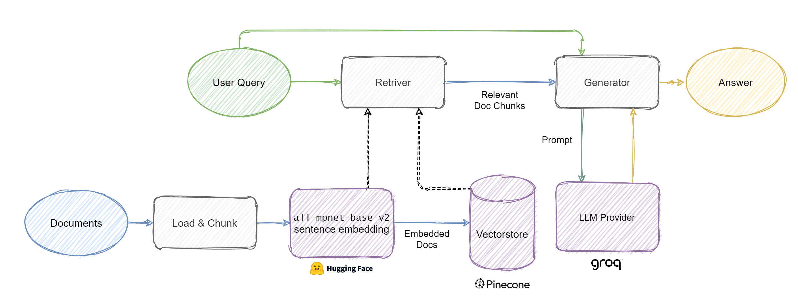
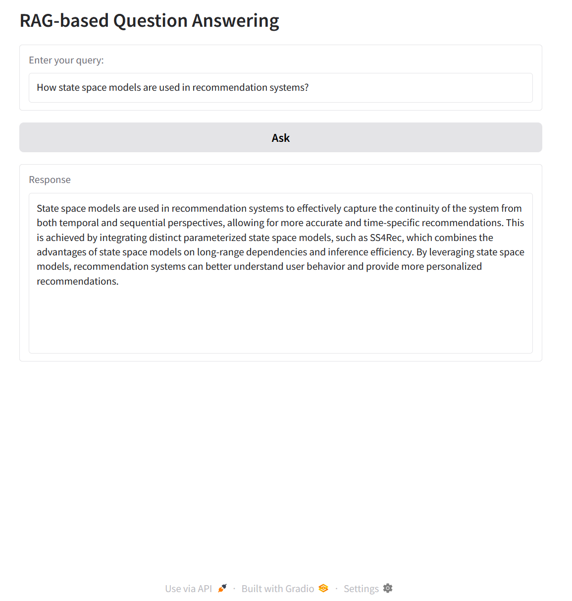

# RAG-Application

## Overview

This project is an application of a Retrieval-Augmented Generation (RAG) system designed to retrieve and generate answers from PDFs. It leverages Pinecone as a vector database for semantic search and Groq as an LLM service for answer generation. A user-friendly Gradio-based GUI is provided to simplify querying and retrieving relevant information.



## Usage

To run the application, follow these steps:

1. Clone the repository:

    ```bash
    git clone https://github.com/moziada/RAG-Application.git
    ```

2. install the necessary dependencies, run:

    ```bash
    pip install -r requirements.txt
    ```

3. create a `.env` file that contains the required API keys with the followning format:

    ```bash
    PINECONE_ENV="YOUR-ENV"
    PINECONE_API_KEY="YOUR-KEY"
    PINECONE_INDEX_NAME="YOUR-INDEX-NAME"
    GROQ_API_KEY="YOUR-KEY"
    ```

4. Put your PDF files into `data` directory.

5. Run `create_database.py` script to chunk and store your PDF documents into Pinecone vector database.

6. Run `app.py` script to run the Gradio based application.

Here’s an example of the app answering questions based on the context of the [SS4Rec](https://arxiv.org/abs/2502.08132) paper.

